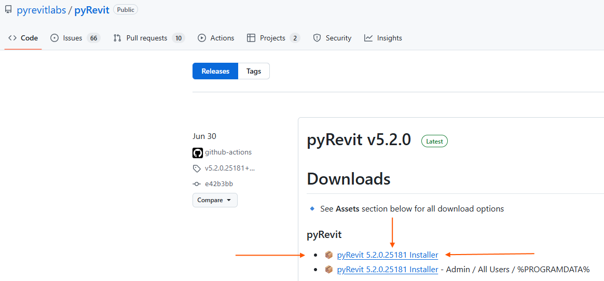
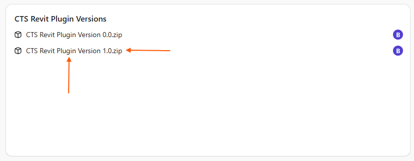
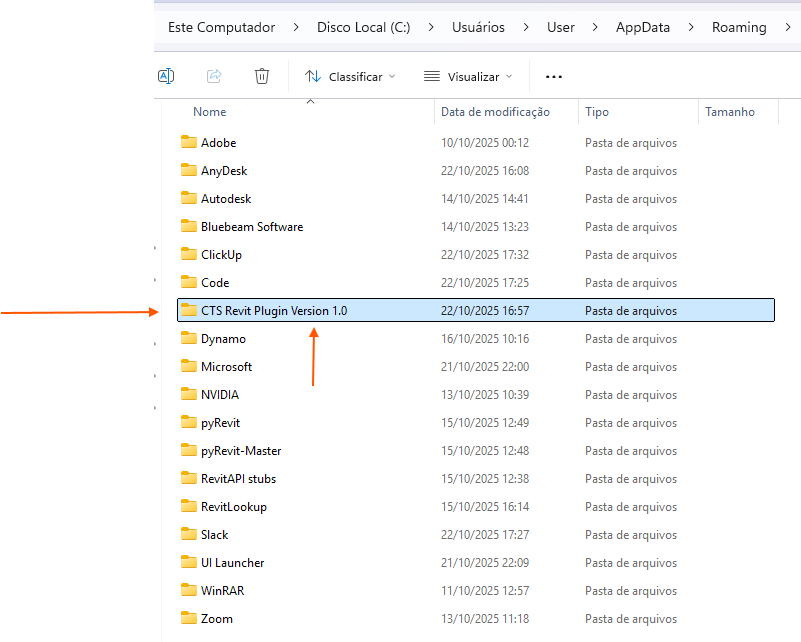
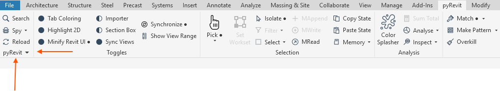
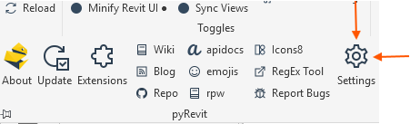
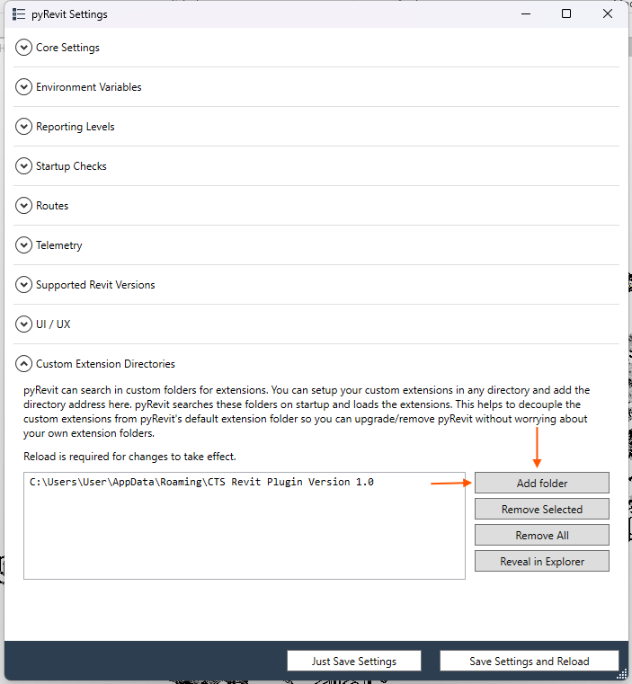
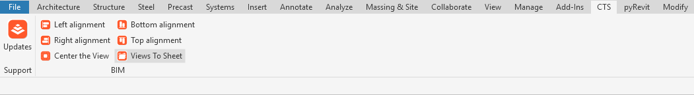

# CTS Revit Plugin

[pyRevit](https://github.com/pyrevitlabs/pyRevit) extension developed by CTS BIM with productivity tools for BIM and MEP modeling in Autodesk Revit.

The extension adds a **CTS** tab to the Revit ribbon, organized into three panels: **BIM**, **MEP**, and **Support**.

## Compatibility

- Autodesk Revit **2023 to 2026**
- Requires [pyRevit](https://github.com/pyrevitlabs/pyRevit/releases) to be installed

## Installation

### 1. Install pyRevit

> Skip this step if pyRevit is already installed in Revit.

Go to the [pyRevit releases page](https://github.com/pyrevitlabs/pyRevit/releases) and download the latest version (at the time of this guide, `pyRevit 5.2.0.25181 Installer`).



Run the installer (it's recommended to close Revit during installation). After installing, open Revit and confirm the **pyRevit** tab appears in the ribbon — if it doesn't, restart Revit.

### 2. Download the CTS Plugin (latest version)

Download the latest CTS Plugin package from the [versions channel on ClickUp](https://app.clickup.com/9014580481/v/o/f/90147202119?pr=90142481001).



The plugin is distributed as a `.zip` file and must be extracted before use. After extracting, move the entire plugin folder (e.g., `CTS Revit Plugin Version X.0`) to:

```
C:\Users\<YourUser>\AppData\Roaming
```

Tip: type `%appdata%` in the Windows File Explorer address bar to jump straight to this folder.



### 3. Connect the Plugin to Revit via pyRevit

With pyRevit installed and the CTS Plugin folder in the right place, click the pyRevit arrow icon at the bottom-left corner of the Revit window.



Select **Settings** from the menu.



In the settings window, open **Custom Extension Directories**, click **Add folder**, and select the plugin folder placed in `%appdata%\Roaming` in the previous step (e.g., `C:\Users\User\AppData\Roaming\CTS Revit Plugin Version X.0`).



Click **Save Settings and Reload**. After reloading, the **CTS** tab should appear in the Revit ribbon.



### 4. Updating the CTS Plugin

When a new version is released, repeat steps 2 and 3: download the latest version, extract the folder, move it to `%appdata%\Roaming`, and add the folder again in pyRevit's settings.

> **Important**: before adding the new version, delete the old plugin folder from the system to avoid conflicts between versions.

## Tools

### BIM Panel

| Tool | Description |
|---|---|
| **Smart Concat** | Concatenates values from multiple parameters of the selected elements (Pipe Accessories, Fabrication Hangers, Pipes, Mechanical Equipment, etc.) into a single parameter, via a guided form. |
| **Views By Scope Box** | Duplicates a selected base view once per selected Scope Box, naming each new view with a user-defined prefix + Scope Box name. |
| **Views To Sheet** | Creates sheets for the selected views, auto-numbering them with a given prefix, applying the chosen title block, and centering the view on the sheet. |
| **Center The View** | Centers the viewport on the active sheet and aligns the viewport title directly below it. |
| **Grids 3D to 2D** | Converts all grids visible in the active view from 3D to 2D (view-specific) extents in one click. |

### MEP Panel

| Tool | Description |
|---|---|
| **Connect Hanger** | Automatically connects/hosts a selected Fabrication Hanger onto a selected straight Fabrication pipe. |
| **Flip Elements** | Flips the selected MEP Fabrication Parts, skipping pinned elements or elements that aren't Fabrication Parts. |
| **Hanger without Host** | Finds Fabrication Hangers without a host in the project and isolates them in the active view for review. |
| **MEP Face Aligner** | Moves the selected pipes (native or Fabrication) to align a side (top/bottom/left/right, screen-relative) against a chosen reference element's face. |
| **Parameter Cleaner** | Clears all visible text-type instance parameters (shared/project), plus Mark and Comments, on the selected elements. |
| **Rotate 90°-CW** | Rotates the selected MEP Fabrication Parts 90° clockwise, automatically skipping pinned elements. |
| **Align By X / Y / Z** | Aligns a selected element to a reference element along the model's X, Y, or Z axis, using connector geometry. |

### Support Panel

| Tool | Description |
|---|---|
| **Update** | Direct link to the team's task/update board (ClickUp), used to report bugs and request new features. |

## Authors

- **Bruno Dias**
- **Pedro Oliveira**
